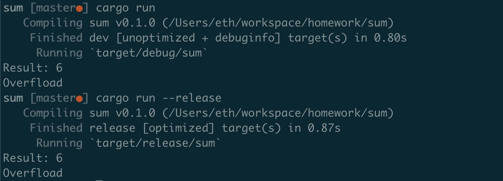

### Checked sum


### Code 

```
fn main() {
    let a = [1, 2, 3];
    let result = sum(&a);
    
    match result {
        Some(x) => println!("Result: {}", x),
        None    => println!("Overfload"),
    }

    let b = [u32::MAX, 1];
    let result = sum(&b);
    
    match result {
        Some(x) => println!("Result: {}", x),
        None    => println!("Overfload"),
    }
}

fn sum(a : &[u32]) -> Option<u32> {
    let result = a.iter().try_fold(0u32, |acc, &x| acc.checked_add(x));
    result
}
```